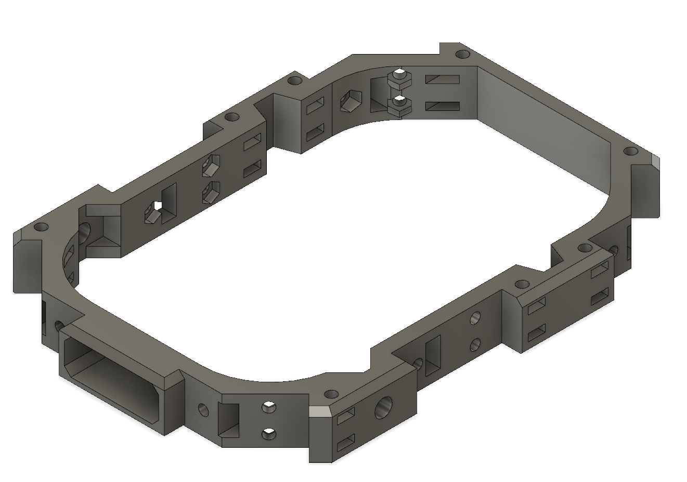
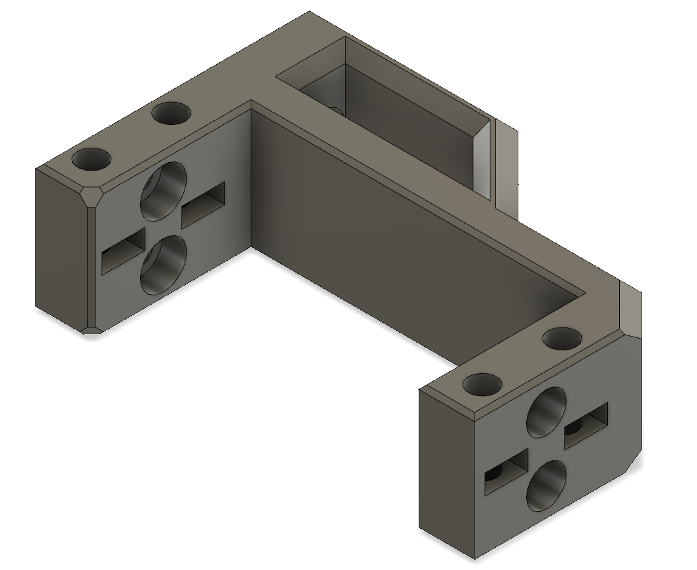
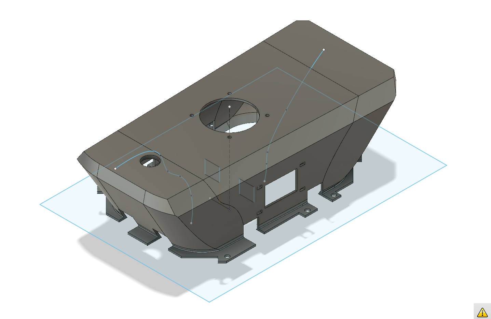
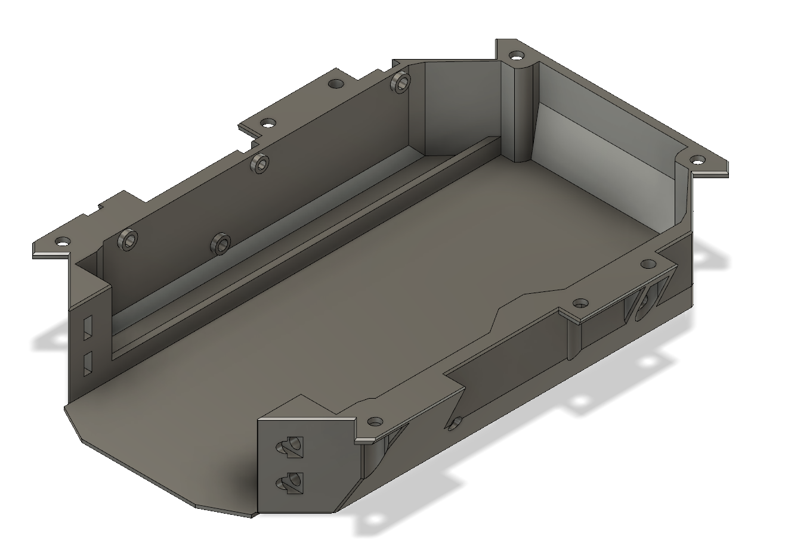
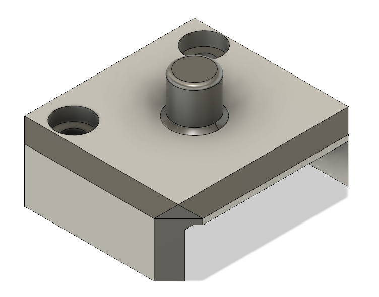
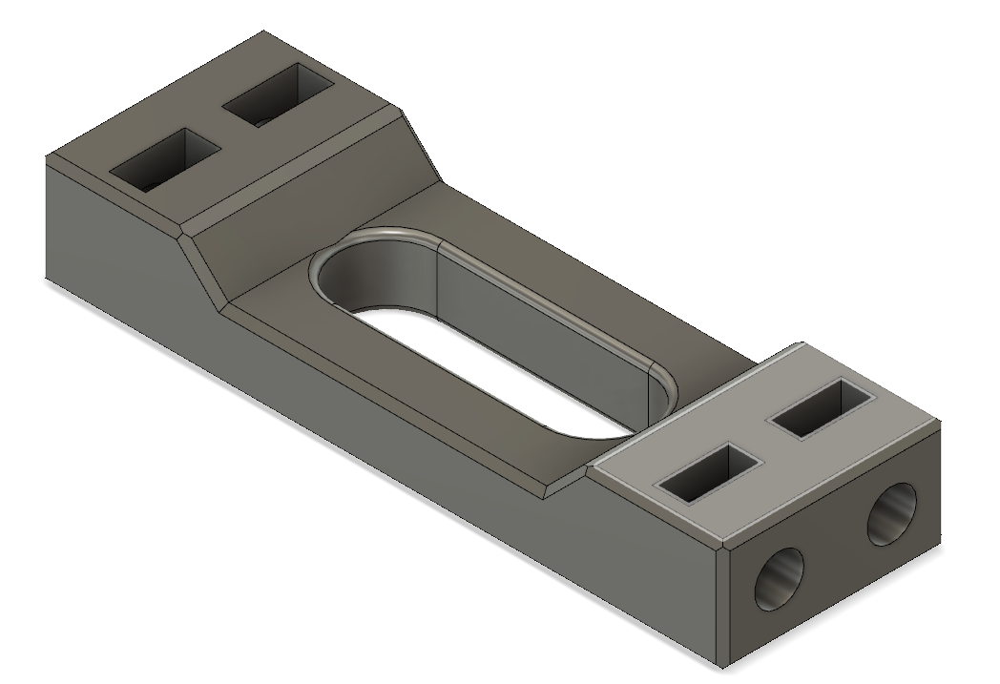
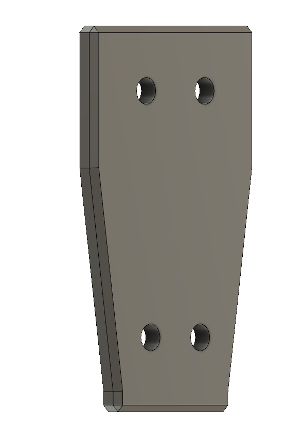
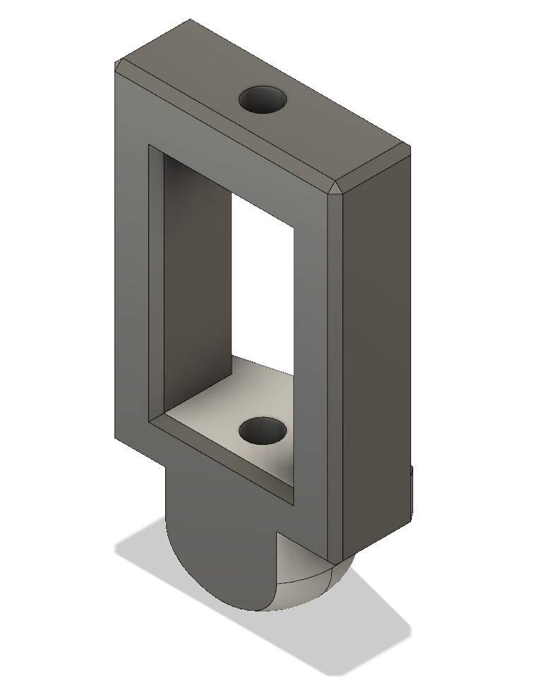
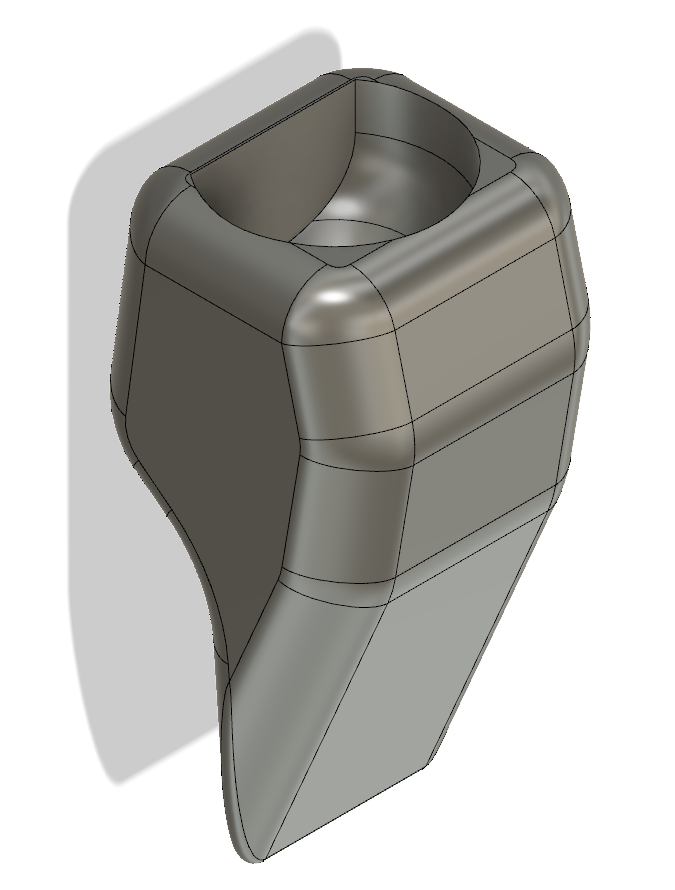

# Spiderbot STLs: 3D-Printed Hexapod Spider Robot Build Guide

## Table of Contents

- [Spiderbot STLs: 3D-Printed Hexapod Spider Robot Build Guide](#spiderbot-stls-3d-printed-hexapod-spider-robot-build-guide)
  - [Table of Contents](#table-of-contents)
  - [Introduction](#introduction)
  - [Acknowledgments](#acknowledgments)
  - [Disclaimer](#disclaimer)
  - [Pre-requisites](#pre-requisites)
  - [Installation](#installation)
  - [Components](#components)
    - [Body Parts](#body-parts)
    - [Leg Parts](#leg-parts)
    - [Other Parts](#other-parts)
  - [Contribution](#contribution)
  - [License](#license)

---

## Introduction

This repository contains STL files, 3D printing instructions, and build documentation for SpiderBot, a 3D-printed spider robot. Here you'll find all you need to build your own SpiderBot, whether you're a beginner or an experienced robotics enthusiast.

---
## Acknowledgments

While the [MakeYourPet project](https://github.com/makeyourpet/hexapod) served as an initial inspiration, the 3D parts used in this Hexapod Spiderbot Model are not from their official designs. Special credit goes to 'amelendez8', a Discord server user from MakeYourPet's community. I have adapted and modified his design for the purpose of this project. You can find his original work [here](https://github.com/almelnz2005/hexapod).

---
## Disclaimer

This project is intended for educational purposes. Please exercise caution and read all safety guidelines when working with electronics and 3D printers. We are not responsible for any damage caused during the build.

---

## Pre-requisites

- 3D printer with PLA filament
- Basic knowledge of electronics
- Soldering kit
- [Optional] CAD software like Fusion 360 for customization

---

## Installation

Clone this repository using the following command:

```bash
git clone https://github.com/YourUsername/ArachnoBot-STL.git
```

---

## Components

### Body Parts

| Part Name | Description |3D Printing Instructions | Count | Photo | Link to STL |
|-----------|-------------|-------------------------|-------|-------|-------------|
| Frame | Serves as the robot's central structure. | Layer height: 0.2mm, Fill: 20%, No supports needed | 1 |  | [Frame](./stl/Frame.stl) |
| Frame Center Servo Holder | Holds the servo motor in the central part of the frame. | Layer height: 0.2mm, Fill: 30%, Supports: No | 2 - for hexapod |  | [Frame Center Servo Holder](./stl/FrameCenterServoHolder.stl) |
| Frame Side Servo Holder | Holds the servo motors on either side of the frame. | Layer height: 0.2mm, Fill: 30%, Supports: No | 4 |  | [Frame Side Servo Holder](./stl/FrameSideServoHolder.stl) |
| Carapace | Consists of 3 parts: Front, Mid, Back. Design with tongue and groove technique for easy assembly comming soon. | Layer height: 0.2mm, Fill: 20%, Supports: Yes | 1 set |  | [Carapace Front](./stl/CarapaceFront.stl)<br /> [Carapace Mid](./stl/CarapaceMid.stl) <br /> [Carapace Back](./stl/CarapaceBack.stl) |
| Power compartment | Holds the 2S LiPo Battery securely. | Layer height: 0.2mm, Fill: 30% | 1 |  | [Power compartment](./stl/PowerCompartment.stl) |
| Power compartment door | Door for the power compartment. Future improvement: snap-fit design. | Layer height: 0.2mm, Fill: 20%, Supports: No | 1 |  | [Power compartment door](./stl/PowerCompDoor.stl) |
| Electronics plate | Sits between the Power compartment and the Frame, holding electronics in place. | Layer height: 0.2mm, Fill: 20% | 1 |  | [Electronics plate](./stl/ElectronicsPlate.stl) |
| Controller plate | Designed to hold controllers like Raspberry Pi or Servo 2040. Can be attached to the Electronics plate or Carapace (middle). | Layer height: 0.2mm, Fill: 20% | 1 |  | [Controller plate](./stl/ControllerPlate.stl) |

### Leg Parts

| Part Name | Comments | 3D Printing Instructions | Count | Photo | Link to STL |
|-----------|----------|--------------------------|-------|-------|-------------|
| Servo joint | Connects servo to leg components | | 3 per leg |  | [Servo joint](./stl/ServoJoint.stl) |
| Leg rib | Adds structural integrity to the legs | | 2 per leg |  | [Leg rib](./stl/LegRib.stl) |
| Coxa Side 1 | Upper part of the leg, connects to the servo joint | Layer height: 0.2mm, Fill: 30% | 1 per leg |  | [Coxa Side 1](./stl/CoxaSide1_625ZZ.stl) |
| Coxa Side 2 | Companion to Coxa Side 1, forms the upper leg part. | Layer height: 0.2mm, Fill: 30% | 1 per leg |  | [Coxa Side 2](./stl/CoxaSide2_8holes.stl) |
| Femur side 1 | Middle segment of the leg | | 1 per leg |  | [Femur side 1](./stl/FemurSide1_625ZZ.stl) |
| Femur side 2 | Companion to Femur side 1, forms the upper leg part.| | 1 per leg |  | [Femur side 2](./stl/FemurSide2_8Holes.stl) |
| Tibia top | Lower leg part connecting to femur | Layer height: 0.1mm, Fill: 30% | 1 per leg |  | [Tibia top](./stl/TibiaTop.stl) |
| Tibia bottom | End segment of the leg | | 1 per leg |  | [Tibia bottom](./stl/TibiaBottomLong.stl) |
| Leg shield | Covers and protects leg mechanics | | 1 per leg |  | [Leg shield](./stl/LegShield.stl) |
| Micro switch holder | Holds the micro switch in place for leg feedback | | 1 per leg |  | [Micro switch holder](./stl/MicroswitchHolderRound.stl) |
| Micro switch cover | Covers the micro switch for protection | | 1 per leg |  | [Micro switch cover](./stl/SwitchCover.stl) |
| Leg tip | End tip for the legs, provides better grip | | 1 per leg |  | [Leg Tip](./stl/Tip.stl) |
| Claw | Use soft material tip for better grip and silent movement | Material: TPU | 1 per leg |  | [Claw](./stl/Claw.stl) |


### Other Parts

| Part Name | Comments | 3D Printing Instructions | Count | Photo | Link to STL |
|-----------|----------|--------------------------|-------|-------|-------------|
| Spiderbot stand | Consists of 2 separate pieces: a stand and a leg. This allows for airborne testing of the robot. The leg can be attached to a stable object like a tripod or weights for added stability. | Layer height: 0.3mm, Fill: 40%. For a taller stand, scale the leg in the Z direction. | 1 set (1 stand, 1 leg) |   | [Leg](./STL/ServoMount.stl)<br />------<br /> [Stand](./STL/ServoMount.stl) |

---

## Contribution

Contributions are welcome! Please read the [Contribution Guidelines](CONTRIBUTING.md) for more information.

---

## License

This project is licensed under the MIT License - see the [LICENSE.md](LICENSE.md) file for details.
