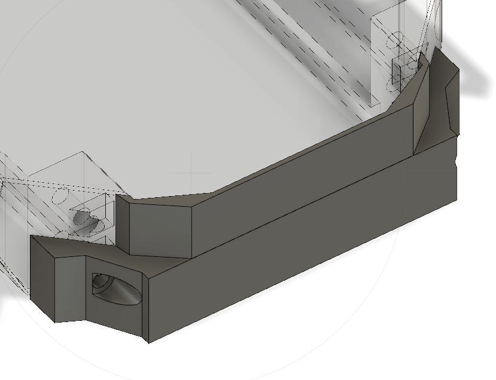
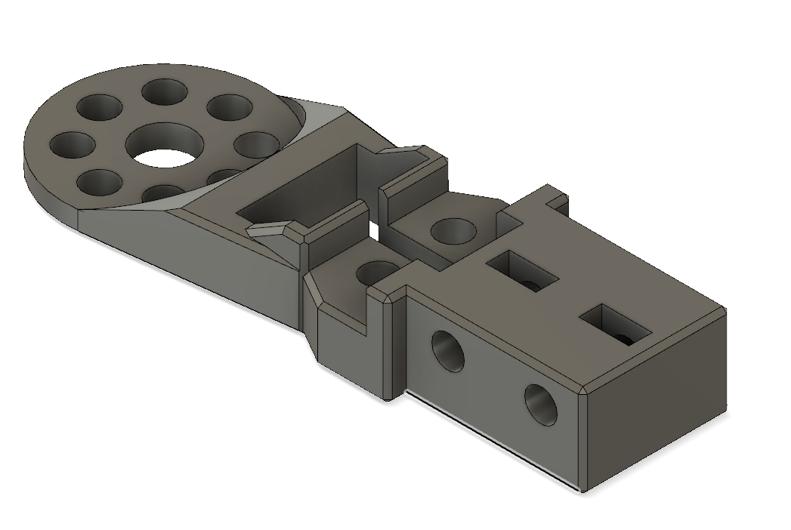
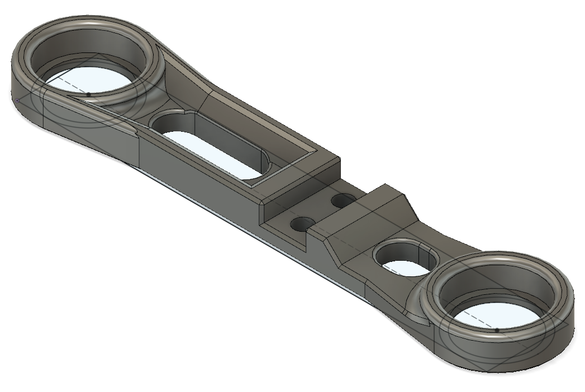
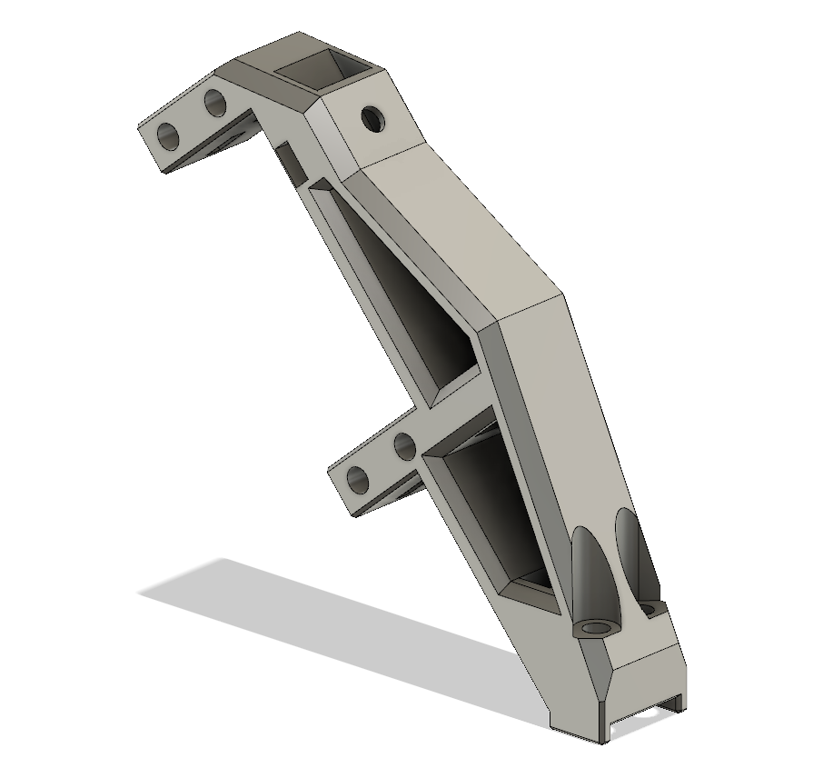
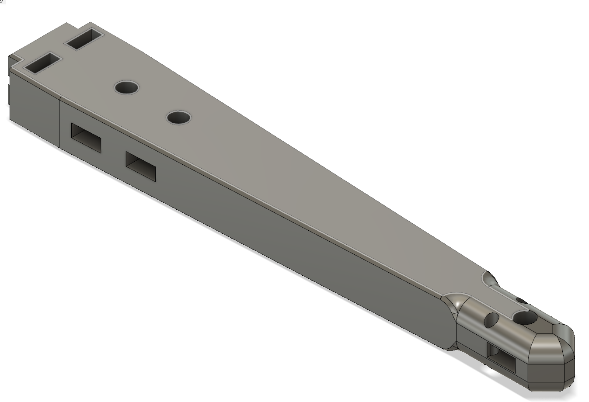
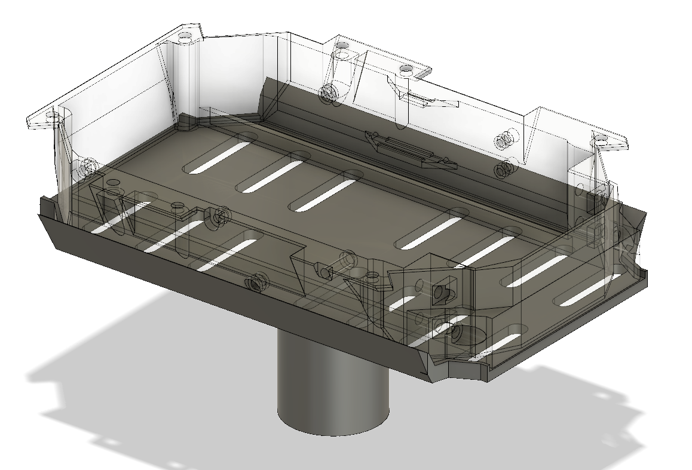

# Spiderbot STLs: 3D-Printed Hexapod Spider Robot Build Guide

## Table of Contents

- [Spiderbot STLs: 3D-Printed Hexapod Spider Robot Build Guide](#spiderbot-stls-3d-printed-hexapod-spider-robot-build-guide)
  - [Table of Contents](#table-of-contents)
  - [Introduction](#introduction)
  - [Acknowledgments](#acknowledgments)
  - [Disclaimer](#disclaimer)
  - [Pre-requisites](#pre-requisites)
  - [Installation](#installation)
  - [Components](#components)
    - [Body Parts](#body-parts)
    - [Leg Parts](#leg-parts)
    - [Other Parts](#other-parts)
  - [Contribution](#contribution)
  - [License](#license)

---

## Introduction

This repository contains STL files, 3D printing instructions, and build documentation for SpiderBot, a 3D-printed spider robot. Here you'll find all you need to build your own SpiderBot, whether you're a beginner or an experienced robotics enthusiast.

---
## Acknowledgments

While the [MakeYourPet project](https://github.com/makeyourpet/hexapod) served as an initial inspiration, the 3D parts used in this Hexapod Spiderbot Model are not from their official designs. Special credit goes to 'amelendez8', a Discord server user from MakeYourPet's community. I have adapted and modified his design for the purpose of this project. You can find his original work [here](https://github.com/almelnz2005/hexapod).

---
## Disclaimer

This project is intended for educational purposes. Please exercise caution and read all safety guidelines when working with electronics and 3D printers. We are not responsible for any damage caused during the build.

---

## Pre-requisites

- 3D printer with PLA filament
- Basic knowledge of electronics
- Soldering kit
- [Optional] CAD software like Fusion 360 for customization

---

## Installation

Clone this repository using the following command:

```bash
git clone https://github.com/YourUsername/ArachnoBot-STL.git
```

---

## Components

### Body Parts

| Part Name | Description | Count |3D Printing Instructions | Photo | Link to STL |
|-----------|----------|--------|--------------------------|-------|-------------|
| Frame | This serves as the robot's central structure | x1 |  | |
| Carapace | Consisits of 3 parts: Front, Mid, Back. <br />**TODO:** tongue and groove technique | Layer height: 0.2mm, Fill: 20%, Supports: Yes |  | [Download STL](./STL/MainBody.stl) |
| Power compartment | Holds the 2S LiPo Battery | Layer height: 0.2mm, Fill: 30% | | [Download STL](./STL/BatteryHolder.stl) |
| Power compartment door | **TODO:** Needs improvement - maybe rewoork it to be snap-fit design || |
| Electronics plate | plate between Pawer compartment Frame | |  |
| Controller plate | Allows to attach controller (Compatible with raspberry and Serco 2040) to Electronics plate or Carapace (middle) | |  |

### Leg Parts

| Part Name | Comments | 3D Printing Instructions | Photo | Link to STL |
|-----------|----------|--------------------------|-------|-------------|
|Servo joint||||
|Leg rib|||  |
| Coxa Side 1 | Upper leg part | Layer height: 0.2mm, Fill: 30% |  | [Download STL](./STL/Femur.stl) |
| Coxa Side 2 | Upper leg part | Layer height: 0.2mm, Fill: 30% |  | [Download STL](./STL/Femur.stl) |
| Femur side 1 | | |  |
| Femur side 2 | | |  |
| Tibia top | Lower leg part | Layer height: 0.1mm, Fill: 30% | | [Download STL](./STL/Tibia.stl) |
| Tibia bottom | | |  |
| Leg shield |||  |
| Micro switch holder |||  |
| Micro switch cover | | |  |
| Leg tip | | |  |
| Claw | Made out of soft material it silences robot movement and improves its traction to the ground | Material: TPU |  |
### Other Parts

| Part Name | Comments | 3D Printing Instructions | Photo | Link to STL |
|-----------|----------|--------------------------|-------|-------------|
| Spiderbot stand | Consists of 2 parts that can be glued together: stand and leg. Allows for robot testing in the air. LEg should be attache dto something stable (tripod, weights etc) | Layer height: 0.3mm, Fill: 40% Scale leg in Z direction of you need it higher. |   | [Leg](./STL/ServoMount.stl)<br />------<br /> [Stand](./STL/ServoMount.stl) |

---

## Contribution

Contributions are welcome! Please read the [Contribution Guidelines](CONTRIBUTING.md) for more information.

---

## License

This project is licensed under the MIT License - see the [LICENSE.md](LICENSE.md) file for details.
